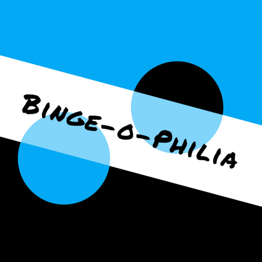
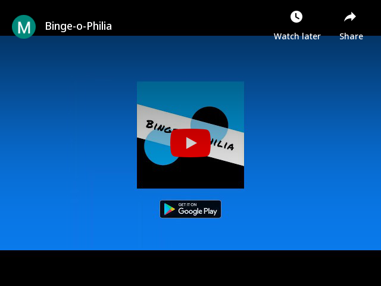

# Binge-o-Philia

Repository Containing the documents submitted to the [App Innovation Challenge 2020](https://innovate.mygov.in/app-challenge/)

  

Binge-o-Philia is a social-networking platform for movie buffs.

A single place for:
- Connecting with people ("binge-philes")
- Managing your leisure (show-watching) time
- Reducing the friction of finding a perfect time to watch a show together
- Keeping a record of shows you've watched
- Browsing all the information about new and happening going on in the fiction world

Get all these features right here!
Not to mention, the proper reminders/notifications about your upcoming watch or when your friend just posted a new Movie Review ... all sorted!

So ...
- Ever wanted to connect with people just for the sake of enjoying a movie, or cinema itself?
- Ever wanted to watch a movie with your friend at the same time so that you can discuss it out after a watch but unable to find a right time due to busy schedule?
- Ever wanted absolutely genuine reviews from your peers before going to watch a movie?
- Do you like to keep track of everything, even the shows, movies or tv-serials watched?
- Do you want to keep updated of the latest trends of movies or shows?

If the answer to any of them is YES, then this is the app for you! :)

## Demo

      

